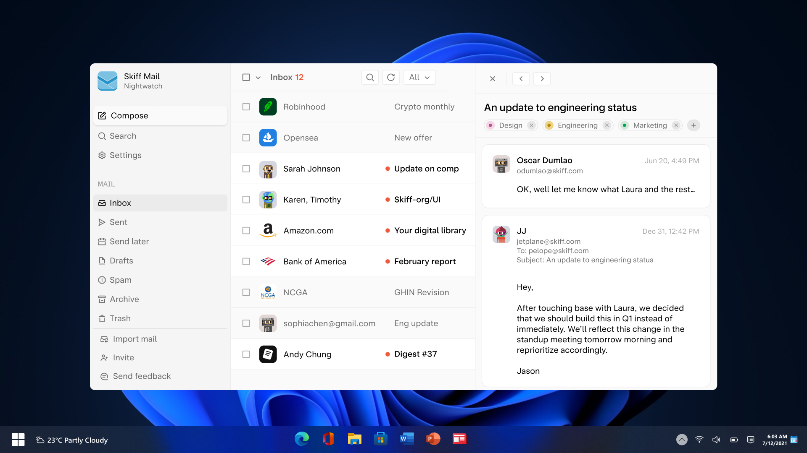

# Skiff Windows app

> [!NOTE]
> The Skiff Windows app is in its earliest beta version currently. We welcome all feedback.

This repository contains Skiff's native Windows app. The Windows app is a native WPF application built using the WebView2 Edge/Chromium runtime, with native bindings added to support file upload, file download, hardware keys, and other features.

## Features
The Skiff Windows app supports all Skiff products: Mail, Calendar, Pages, and Drive. Drag/drop files, compose emails, collaborate in real-time, and even use your hardware keys or biometrics to secure your account. 

## Development
Visit the [skiffWindowsApp](/skiffWindowsApp/) directory for more information on how to build and run the app. We recommend developing in the latest version of [Visual Studio](https://visualstudio.microsoft.com/).

## Questions
Contact us at [support@skiff.org](mailto:support@skiff.org), or join our [Discord](https://discord.com/invite/skiff), [Reddit](https://reddit.com/r/skiff), or [Twitter](https://twitter.com/skiffprivacy) to ask questions, contribute feedback, or request features.
